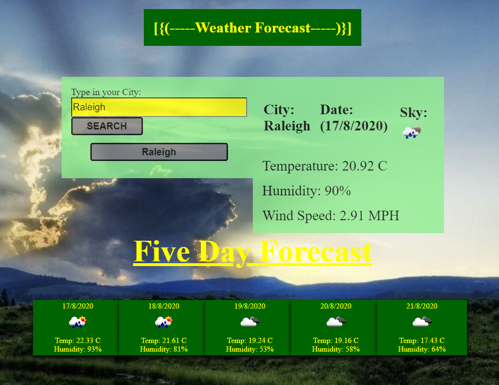

# Weather Forecaster
  ## README created by: MrBusiness87
  
  
  

  ---
  ## Table of Contents:
  * [Title](#Title)
  * [Description](#Description)
  * [Installation](#Installation)
  * [Usage](#Usage)
  * [License](#License)
  * [Questions](#Questions)
  

  ---
  

  ### Title also a Link:
  [Weather Forecaster]("https://mrbusiness87.github.io/Work-Day-Scheduler/")
  

  ### Description:
  This application is one that uses an api called Open Weather Map to display information necessary to reach the end result. My end result is when you search a city in the search bar it will show you the weather at that searched location. Displays that day and then a 5-Day Forecast.
  

  ### Installation:
  The command to install dependencies is: NONE. 
  Go to the git hub page copy link through git bash onto your computer, use command: <b>git clone git@github.com:MrBusiness87/Work-Day-Scheduler.git</b>. This will install it onto your computer, so you can run it locally.

  ### Usage:
  Only to have an application which displays weather on its own page.
  
  ### License:
  
  License None:  When there is no license there is no copyright, except the one you create yourself.
  ---
  ### Questions:
  * GitHub Page: https://github.com/MrBusiness87
  * Please send an email to: bbartula87@gmail.com, with any Questions/Concerns/Comments!
  